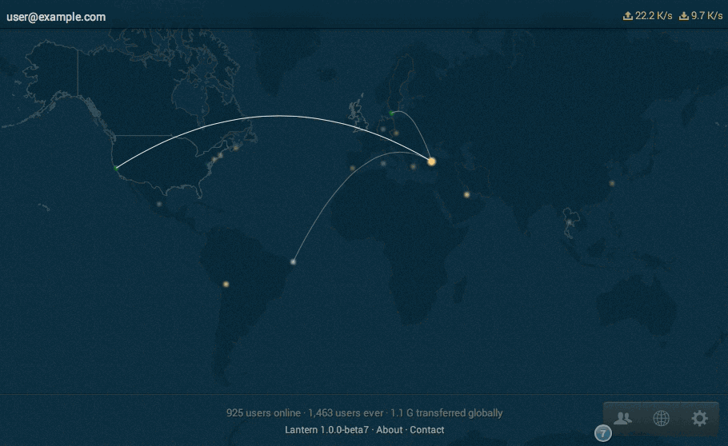

# lantern-ui

UI for [Lantern](https://github.com/getlantern/lantern).

A live demo is deployed to https://lantern-ui.nodejitsu.com/app/index.html running
against the bundled mock server, which simulates a real Lantern backend.
The real backend serves lantern-ui only over localhost, where minification,
concatenation, and other speedups appropriate for remotely hosted files are not
necessary. Please keep that in mind when accessing the public demo.

## Overview

This is the repository for the UI of
[Lantern](https://github.com/getlantern/lantern). It is maintained as
a separate repository to facilitate development. This code can be run
independently of Lantern's Java backend with a lightweight node.js http server
using [Faye](http://faye.jcoglan.com/) to implement Lantern's bayeux server.

See [SPECS.md](https://github.com/getlantern/lantern-ui/blob/master/SPECS.md)
for specifications of the state and the state transitions developed for the
UI (work in progress).

## Getting Started

Install required dependencies (`sudo` as necessary):

* [Node.js](http://nodejs.org/): `brew install node` or equivalent for your
  system

* [Bower](http://bower.io): `npm install -g bower` (only needed if you want to
  be able to update dependencies; they're already checked in to the
  app/bower_components directory so you don't need bower just to fetch them).

* run `npm install` to fetch dependencies specified in package.json

* run `scripts/web-server.js`

You should get a message telling you the application is up and running with
a link to access it.

When you first access the app, you will start at the beginning of the setup
process (will look like the screenshot above). To skip the setup process and
go straight to an already set-up app, run `scripts/web-server.js --skip-setup`.
You should then see something like this when you open the app:

The mock scenarios the app can run with (e.g. your location is London, you have
a friend in Shanghai, etc.) are defined in `mock/scenarios.js`, and are enabled
in `mock/backend.js`.

### For working on the stylesheets:

(Not necessary unless you want to change stylesheets.)

* [ruby](http://www.ruby-lang.org/) (comes with OS X)

* [compass](http://compass-style.org/) 0.12.2:
  `gem install compass --version '= 0.12.2'`.
  
Tell compass to watch for changes in the sass stylesheets and
automatically compile them into css in the directory specified by the compass
config file (`config/compass.rb`):

    $ scripts/start-compass.sh &
    >>> Compass is watching for changes. Press Ctrl-C to Stop.

## i18n

Translated strings are fetched from json files in the "app/locale" directory
and interpolated into the app using
[Angular Translate](https://github.com/PascalPrecht/angular-translate).
To add or change a translated string, update the corresponding mapping
in "app/locale/en_US.json" and add or update any references to it in the app if
needed.

### Transifex

All translatable content for Lantern has been uploaded to [the Lantern
Transifex project](https://www.transifex.com/projects/p/lantern/] to help
manage translations. Translatable strings from this code have been uploaded to
the [ui](https://www.transifex.com/projects/p/lantern/resource/ui/) resource
therein. Transifex has been set up to automatically pull updates to that
resource from [its GitHub
url](https://raw.github.com/getlantern/lantern-ui/master/app/locale/en_US.json)
(see
http://support.transifex.com/customer/portal/articles/1166968-updating-your-source-files-automatically
for more information).

After translators add translations of these strings to the Transifex project,
the [Transifex
client](http://support.transifex.com/customer/portal/articles/960804-overview)
can be used to pull them. See
http://support.transifex.com/customer/portal/articles/996157-getting-translations
for more.

## Running tests

Lantern UI does not yet have a comprehensive set of tests, but the tests that
are written are useful and are set up with continuous integration in
[Travis](https://travis-ci.org/getlantern/lantern-ui).

To run the tests locally, first install karma (`sudo` as necessary):

    npm install -g karma

and [PhantomJS](http://phantomjs.org/) (brew install phantomjs).

Then look in `.travis.yml` for the commands to run the unit and end-to-end tests.

**TODO**: *expand this*

## Further Reading

The UI is implemented as an [AngularJS](http://angularjs.org) app. Using the
[AngularJS Batarang](https://github.com/angular/angularjs-batarang)
Chrome extension (especially the performance tab) can come in handy.

This repo was started with the
[angular-seed](https://github.com/angular/angular-seed). The
`scripts/web-server.js` script has been modified to attach a [bayeux
server](http://svn.cometd.com/trunk/bayeux/bayeux.html) server as mentioned
above and an http API to simulate the Lantern backend. The application logic
for the mock backend can be found in `mock/backend.js`.

Specifications for application states and transitions between them are documented
[here](https://github.com/getlantern/lantern-ui/blob/master/SPECS.md).
